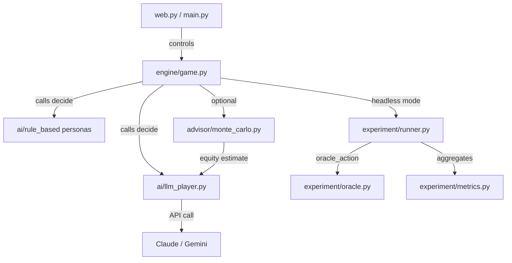

Imagine sitting four large language models at a poker table. Claude Haiku bets 60 chips on the flop. Gemini Flash calls. Claude Sonnet raises to 180. Two hands later, Gemini Flash folds a strong hand — because it noticed, in its context, that Sonnet has been raising aggressively post-flop.

That's not magic. That's a harness.

The [Texas Hold'em trainer](https://github.com/louiswang524/texas_poker) I built is a poker simulator where every seat can be occupied by an LLM: Claude, Gemini, or a rule-based fallback. Players remember each other across hands, adapt their strategy, and get evaluated not just on winnings but on the quality of their reasoning.

The interesting part isn't the poker. It's the pattern that makes it work — a pattern I'll call the **agent harness**, and one that generalizes far beyond card games.

## What the Project Does

The project has four main layers:

```
engine/       — core game loop: deck, hand evaluator, betting, game state
ai/           — LLM players (Claude + Gemini) and rule-based personas
advisor/      — Monte Carlo equity calculator (win probability simulation)
experiment/   — headless runner, GTO oracle, process metrics
web.py        — FastAPI + WebSocket server for browser UI
```

Here's how they connect:



The browser UI (FastAPI + WebSocket) streams live game state to any spectator. You can watch four LLMs play each other in real time, with a spectator mode that shows every player's cards and decision. There's also a CLI mode via Rich for headless use.

The experiment framework runs hundreds of hands automatically, recording every decision alongside the theoretically correct action, then aggregates the results into statistical reports.

## The Agent Harness Pattern

After building this, I noticed the architecture reduces to three reusable components. I'll call it the **agent harness pattern**.

### 1. The Arena

The arena is the stateful environment all agents share. In poker, it's `engine/game.py`: it tracks the deck, community cards, pot, player stacks, and whose turn it is. After each agent action, the arena advances state and calls the next agent.

The arena has one job: **manage shared state and sequence agent turns**. It knows nothing about how agents make decisions. It just calls them and applies the result.

```python
# engine/loop.py — simplified
for player_id in active_players:
    action = ai_players[player_id].decide(game)
    game.apply_action(player_id, action)
```

The arena advances when an action lands. It doesn't care whether that action came from a 70B parameter model or a three-line `if` statement.

### 2. The Agent Interface

Every agent — whether Claude Haiku, Gemini Flash, or a hardcoded bluffer — implements the same interface:

```python
class AIPlayer:
    def decide(self, game: Game) -> Action:
        raise NotImplementedError
```

That's it. The arena doesn't know or care what's behind `decide()`. This single-method contract is what makes the system composable: you can swap models, swap strategies, or mix LLM and rule-based agents at any seat without changing the arena.

The LLM player builds a prompt from the game state (hole cards, community cards, pot, opponent stacks, betting history), calls the API, and parses the JSON response. Four prompt strategies ship with the project:

```python
_SYSTEM_PROMPTS = {
    "baseline": "...respond with JSON only...",
    "cot":      "...think step by step, then JSON on the last line...",
    "persona":  "...tight-aggressive style, only premium hands...",
    "gto":      "...fold if equity < pot_odds, raise if equity > pot_odds + 0.05...",
}
```

Each strategy changes only the system prompt. The interface — and the arena — stay the same.

### 3. The Observer Layer

The observer layer is what separates a toy demo from a research platform. It sits alongside the arena, answering two questions: *what just happened?* and *what should have happened?*

In the poker project, the observer has three parts:

**Cross-hand memory.** After each hand, the LLM is asked to write 1–2 sentences summarizing any patterns it noticed in opponents. These observations are injected into the next decision prompt. Agents adapt across hands — not just within a single decision.

**Decision logging.** Every decision is recorded with its full context: hand number, player, model, strategy, equity at decision time, pot odds, and action taken.

**GTO (Game Theory Optimal) oracle.** For each logged decision, the oracle computes the theoretically correct action from equity and pot odds alone:

```python
# experiment/oracle.py
def oracle_action(equity: float, pot_odds: float, can_check: bool) -> ActionType:
    if can_check:
        return RAISE if equity >= 0.60 else CHECK
    if equity < pot_odds:
        return FOLD
    elif equity >= pot_odds + 0.05:
        return RAISE
    return CALL
```

The oracle lets you ask not just "who won chips?" but "who played correctly?" — a far more informative signal when you're trying to evaluate agent reasoning.

## What Emerges When Agents Interact

Running 200+ hands reveals dynamics that don't show up in single-hand benchmarks.

**Strategy divergence.** The CoT (chain-of-thought) strategy produces longer reasoning traces but isn't uniformly better. Sometimes the model reasons its way into a suboptimal fold. The GTO strategy is often more accurate because it's constrained: the prompt externalizes the decision rule (estimate equity, compare to pot odds, act accordingly), so the model just has to follow instructions rather than reason from scratch.

**Reasoning audits.** The CoT audit checks whether the model's stated conclusion matches its action. If the model writes "I should call here" but the JSON says `{"action": "fold"}`, that's flagged as `reasoning_consistent = False`. In our experiment runs, this catches 8–12% of CoT decisions — a rate high enough to flag as a systematic gap between stated reasoning and actual behavior.

**GTO adherence by model.** Our runs suggest larger models adhere to GTO more consistently, but the relationship isn't linear. A small model with the `gto` strategy (explicit equity heuristic in the prompt) can match or beat a larger model using `baseline`, because the strategy offloads the hard part of the reasoning to the prompt itself.

**bb/100 (big blinds per 100 hands) as the outcome metric.** Win rate in big blinds per 100 hands — reported with 95% confidence intervals — lets you compare agents statistically. Two agents can post identical bb/100 via completely different reasoning paths. Process metrics (GTO adherence, reasoning consistency) are what distinguish lucky play from structurally correct play.

## From Poker to Marketplace

The three harness components generalize directly to any competitive multi-agent domain.

| Poker | Social Marketplace |
|---|---|
| `engine/game.py` (arena) | Auction / pricing engine |
| `decide(game_state) → action` | `bid(market_state) → offer` |
| Cross-hand memory | Buyer/seller reputation, price history |
| GTO oracle | Nash equilibrium bid, historical clearing price |
| bb/100 with CI | Surplus per transaction |

In an eBay-style auction, the arena manages lot state, current high bid, and time remaining. Each buyer agent implements `bid(market_state) → offer`. The observer layer logs bids, computes a theoretical Nash bid from the item's estimated value distribution, and tracks whether agents systematically overbid or underbid relative to that baseline.

In a ride-share pricing market, the arena manages supply, demand signals, and current surge multiplier. Driver and rider agents each implement their side of the `decide()` interface. The observer tracks acceptance rates, compares offered prices to theoretical equilibrium, and flags agents that behave irrationally given market conditions.

The key insight: **poker is a closed-form version of competitive multi-agent interaction with known optimal play.** The GTO oracle gives you ground truth. This lets you calibrate agent quality rigorously before deploying to messier domains where ground truth is harder to compute.

It also means you can **prototype marketplace agents in a poker simulator first.** If your bidding agent can't follow GTO poker (a well-defined, measurable problem), it probably won't handle auction dynamics well either. The poker harness becomes a cheap, fast calibration environment — a flight simulator for agents before they go live.

## What I'd Do Differently

**Memory doesn't scale.** Flat-text observation lists work for a 6-hand session but degrade as history grows. A proper implementation would use a vector store with retrieval, so agents can query "what do I know about this opponent?" rather than reading an ever-growing context injection.

**Monte Carlo is synchronous and slow.** The equity calculator runs per decision (~0.2 seconds for 1,000 simulations). Over 200 hands with 4 players making 20 decisions each, that's 16,000 Monte Carlo runs in the critical path. Running simulations asynchronously — or caching equity by hand stage and board texture — would cut experiment time significantly.

**Turn-based arenas don't cover everything.** Poker is sequential: one player acts at a time. Real marketplaces have concurrent bids, continuous price updates, and agents that can act at any moment. Extending the arena to handle async, non-sequential agent actions is a non-trivial architectural change — closer to a discrete event simulation than a game loop.

**Oracle quality in open domains.** The GTO oracle works in poker because the correct action is computable from equity and pot odds. In a marketplace, "correct" depends on private valuations, incomplete information, and strategic interdependence that resists closed-form solutions. Defining a domain oracle — even an approximate one — is the hardest part of extending the pattern.

## The Takeaway

If you're building a system where multiple LLM agents interact, negotiate, or compete, the agent harness gives you a starting structure:

1. **Define your arena** — what shared state exists, and how does it advance after each action?
2. **Define your agent interface** — one method, one contract, implementation-agnostic
3. **Build your observer layer first** — memory, logging, and a domain oracle; this is where the research value actually lives

The poker project is public at [github.com/louiswang524/texas_poker](https://github.com/louiswang524/texas_poker). The experiment framework (RQ1–RQ4 presets, process metrics, GTO oracle) lives in `experiment/`.

The table seats are open. Bring your own model.

## References

- [Anthropic Claude API documentation](https://docs.anthropic.com)
- [Google Gemini API documentation](https://ai.google.dev/docs)
- [FastAPI documentation](https://fastapi.tiangolo.com)
- Wei, J., et al. (2022). [Chain-of-Thought Prompting Elicits Reasoning in Large Language Models](https://arxiv.org/abs/2201.11903). *arXiv:2201.11903*.
- Heinrich, J., & Silver, D. (2016). [Deep Reinforcement Learning from Self-Play in Imperfect-Information Games](https://arxiv.org/abs/1603.01121). *arXiv:1603.01121*.
- Brown, N., & Sandholm, T. (2019). [Superhuman AI for multiplayer poker](https://www.science.org/doi/10.1126/science.aay2400). *Science*, 365(6456), 885–890.
