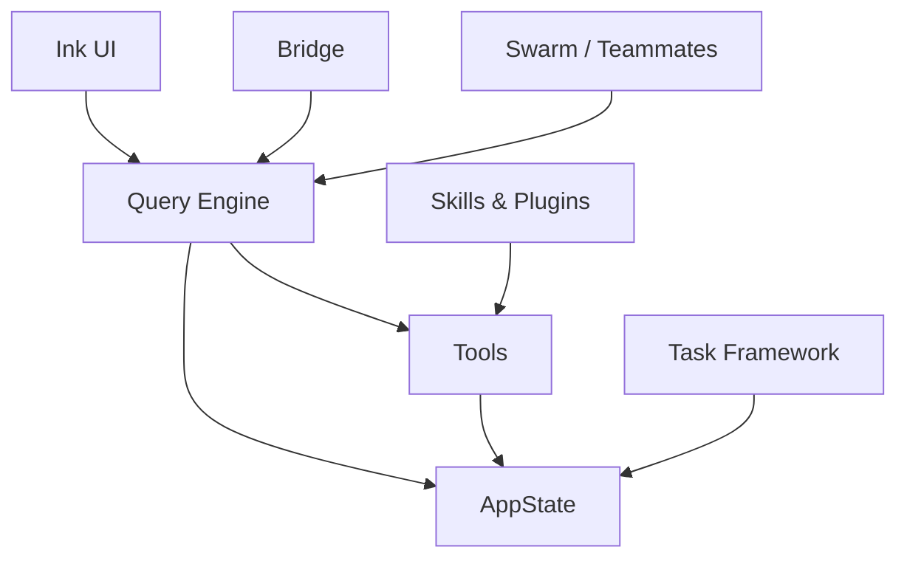

Most developers treat Claude Code as a black box. You type a prompt, files change, tests run, and code appears. The magic stays behind the curtain.

But Claude Code's TypeScript source is readable. Understanding it reveals a clean agent architecture worth studying — not just for Claude Code users, but for anyone building LLM-powered tools.

This is post 1 of 5 in a series called *Demystifying Claude Code*. Here we map the full system: eight subsystems, the core loop, the state model, and the design principles that hold it all together. Four deep-dives follow, each focused on one major subsystem.

The goal is simple. After reading this, you should be able to look at Claude Code's behavior and reason about *why* it does what it does.

## The 8 Subsystems

Claude Code is not a single monolith. It is eight cooperating subsystems, each with a clear boundary and a specific job.

**1. Query Engine** (`QueryEngine.ts`) — the LLM interaction loop. It takes user input, calls the Claude API, processes tool calls, and loops until the model signals it is done. One `QueryEngine` instance manages one conversation.

**2. Tools** (`/tools/`) — 40 LLM-callable functions. Each tool has a typed input schema, an execution function, and a permission check. Tools are how the model reads files, writes code, runs commands, and searches the web.

**3. Task Framework** (`/tasks/`) — background execution tracking. Every spawned process — bash commands, sub-agents, MCP monitors — gets a tracked lifecycle: pending, running, completed, failed, or killed.

**4. AppState** (`/state/AppStateStore.ts`) — the central immutable store. Messages, tasks, MCP connections, plugin state, permission context, and model settings all live here. One object. One source of truth.

**5. Bridge** (`/bridge/`) — remote control via HTTPS polling. This is how claude.ai in a browser drives a Claude Code process on a remote machine. A polling loop pulls work items from the environment API and spawns child processes, communicating with them via piped stdin/stdout.

**6. Swarm / Teammates** (`/utils/swarm/`) — parallel in-process agents. Multiple agent instances run concurrently inside the same Node.js process. Each gets its own state slice via `AsyncLocalStorage`.

**7. Skills & Plugins** (`/skills/`, `/plugins/`) — extensibility layers. Skills are slash commands that inject prompt content. Plugins are installable packages that contribute tools, MCP servers, and lifecycle hooks.

**8. Ink UI** (`/components/`, `/ink/`) — React-for-terminals rendering. The terminal interface is built with Ink, a React renderer for CLIs. Components subscribe to AppState and re-render when it changes.

## The Core Loop

What happens when you press Enter? Here is the exact path, file by file.

Your keystroke first hits the input preprocessing layer. The `earlyInput.ts` module captures terminal keystrokes typed before the REPL is fully initialized — buffering characters so nothing is lost during startup. Once the REPL is ready, the buffered text is consumed and processed normally.

If the input is not a command, it flows to `QueryEngine.submitMessage()`. This is the heart of the agent. The method is an async generator — it `yield`s SDK messages as they arrive.

Inside `submitMessage()`, the engine builds a system prompt from `fetchSystemPromptParts()`. It assembles tool definitions, memory files, and context. Then it calls the Claude API via the `query()` function in `query.ts`.

The API responds with a stream. As tokens arrive, the engine watches for **tool use blocks**. A tool use block is a structured JSON request from the model. It names a function and provides typed arguments. For example: `{ name: "Bash", input: { command: "npm test" } }`.

This is the critical point to understand: the LLM never directly executes anything. It *requests* that a named tool be run. The agent decides whether to honor that request.

Every tool call passes through the permission gate — `hasPermissionsToUseTool()`, which implements the `CanUseToolFn` type — before execution. This function checks permissions, validates input, and may prompt the user for approval. Only after passing this gate does the tool's `call()` method run.

The tool returns a result. That result is fed back into the conversation as a user message (per the Anthropic API protocol). The engine loops: another API call, more potential tool calls, more results.

The loop ends when the model's response has a `stop_reason` of `end_turn` — meaning the model has nothing left to do. At that point, state is updated, usage is recorded, and the UI renders the final output.

## AppState — The Spine

Why does an agent need a central immutable store? Web apps use Redux for UI consistency. Agents need it for a different reason: **inspectability**.

An agent's entire world — messages, tasks, MCP connections, permission context, model settings — lives in one `AppState` object defined in `AppStateStore.ts`. The type is wrapped in `DeepImmutable<>`, which means nothing can mutate it directly. Every state change goes through `setAppState()`, a function that takes the previous state and returns the next.

This design makes the agent's state serializable at any point. You can snapshot what it knew, what it was doing, and what permissions it had. That matters for debugging, for replay, and for understanding why the agent took a particular action.

Contrast this with the ad-hoc alternative: scattered globals, mutable singletons, and state buried inside closures. With that approach, you cannot snapshot the agent. You cannot replay its decisions. You cannot reason about what it knew when it made a choice.

The store also enables parallel agents. When the swarm subsystem spawns in-process teammates, each gets its own state slice via `AsyncLocalStorage`. The teammates do not fork the entire store. They get isolated context within a shared process.

## The Bridge

How does claude.ai in a browser drive a Claude Code process running on your remote machine? The Bridge subsystem solves this.

The entry point is `bridgeMain.ts`. When you run `claude remote-control`, the bridge registers with an environment API. It then enters a polling loop via `runBridgeLoop()`. The loop calls `pollForWork()` to check for new session requests.

When work arrives, the bridge decodes a `WorkSecret` containing an access token, API base URL, and session configuration. It spawns a child Claude Code process with `stdio: ['pipe', 'pipe', 'pipe']`, meaning all communication between the bridge and the child flows through piped stdin, stdout, and stderr. The child process itself may connect to Session-Ingress via WebSocket for real-time messaging with the browser, but the bridge supervisor controls the child through standard I/O pipes.

The bridge supports three spawn modes, defined as a `SpawnMode` union type in `types.ts`:

- **`single-session`** — one session in the current directory. The bridge tears down when it ends. This is the default for `claude remote-control`.
- **`worktree`** — persistent server mode. Every session gets an isolated git worktree. Sessions cannot interfere with each other's files.
- **`same-dir`** — persistent server mode. Every session shares the working directory. Simpler, but sessions can overwrite each other's changes.

The bridge also manages heartbeats, token refresh, and graceful shutdown. Each active session gets a `SessionHandle` with a `done` promise, a `kill()` method, and activity tracking.

## Skills vs. Plugins

Claude Code has two extension points for two different user types.

**Skills** are slash commands. They are registered via `registerBundledSkill()` in `bundledSkills.ts`. Each skill has a `name`, `description`, optional `allowedTools`, and a `getPromptForCommand` function that returns content blocks. When you type `/commit` or `/review`, the skill injects prompt content into the conversation. The model then acts on that content. Skills run *as* the agent — they are instructions Claude follows.

**Plugins** extend *around* the agent. They are installable packages that register capabilities from outside. The plugin scaffolding lives in `/plugins/bundled/index.ts`, with a `registerBuiltinPlugin()` pattern for plugins that ship with the CLI. Plugins can contribute commands, MCP servers, and lifecycle hooks.

The key difference: skills shape what the model thinks about. Plugins shape what the model can do. Skills are prompt engineering. Plugins are capability engineering.

## Design Principles

Five principles emerge from reading the source. Each is a design choice worth stealing.

**1. Tools are the API surface between the LLM and the world.** Design them like REST endpoints: small, typed, single-purpose. Claude Code has 40 tools, each defined with a Zod input schema and an isolated `call()` function. The `Tool` type in `Tool.ts` enforces this contract — every tool must declare `inputSchema`, `call`, `checkPermissions`, and `isReadOnly`.

**2. Centralize state, isolate execution.** One `AppState` store means the whole agent is inspectable at any point. Parallel agents use `AsyncLocalStorage` to get their own state slice without forking the store. The state is immutable (`DeepImmutable<>`), so changes are always explicit.

**3. Permission gates belong at the tool boundary, not inside tools.** Every tool call passes through the permission gate (`hasPermissionsToUseTool()`) before execution. The tool itself has no say in whether it runs. This separates "what can I do" from "should I do it" — a clean security boundary.

**4. Build for interruption.** Every task has a tracked lifecycle: pending, running, completed, failed, or killed. The `TaskStatus` type in `Task.ts` defines exactly these five states. The `isTerminalTaskStatus()` helper guards against injecting messages into dead tasks. The agent can be stopped, inspected, and resumed because that lifecycle is in the store.

**5. Extension points should be explicit contracts.** Skills register via `BundledSkillDefinition` — a typed interface with `name`, `description`, `getPromptForCommand`, and optional hooks. Plugins register via `registerBuiltinPlugin()`. Neither can reach into agent internals. They contribute what the interface allows — nothing more.

## So What?

Claude Code is not magic. It is a well-structured agent with clean boundaries between subsystems. The LLM never touches your files directly — it requests actions through typed tools. A central store makes the agent's state inspectable. Permission checks happen at the boundary, not inside the tools. Extension points have explicit contracts.

If you are building an LLM-powered tool, these patterns are worth adopting. If you are using Claude Code, understanding them helps you predict its behavior and debug when things go wrong.

## Source Code

Key files referenced in this post, for readers who want to explore the source directly:

- `QueryEngine.ts` — the main LLM interaction loop; manages conversation turns, tool call processing, and streaming
- `Tool.ts` — the tool interface definition; every tool must declare `inputSchema`, `call`, `checkPermissions`, and `isReadOnly`
- `Task.ts` — the task abstraction and lifecycle; defines `TaskStatus` (pending, running, completed, failed, killed)
- `state/AppStateStore.ts` — central immutable state store; wraps all agent state in `DeepImmutable<>`
- `utils/permissions/permissions.ts` — the permission gate; exports `hasPermissionsToUseTool()` which implements the `CanUseToolFn` type
- `bridge/bridgeMain.ts` — remote control polling loop; registers with the environment API, polls for work, spawns child sessions
- `bridge/bridgeApi.ts` — HTTP client for the bridge environment API; implements `pollForWork()`, `registerBridgeEnvironment()`, heartbeats, etc.
- `bridge/sessionRunner.ts` — child process spawner; creates piped stdio connections to session processes
- `skills/bundledSkills.ts` — built-in skill registry; registers slash commands like `/commit` and `/review`
- `utils/earlyInput.ts` — early keystroke capture; buffers terminal input typed before REPL initialization

## What's Next

The four deep-dives go deeper into each major subsystem:

- [The Tool Use Loop](/blog/claude-code-tool-use-loop) — how tool calls work end-to-end
- [Security Without a Sandbox](/blog/claude-code-security-permissions) — the permission model
- [Multi-Agent Patterns](/blog/claude-code-multi-agent-patterns) — swarm, teammates, coordinator
- [Designing for Extensibility](/blog/claude-code-plugin-skill-system) — the plugin and skill system
